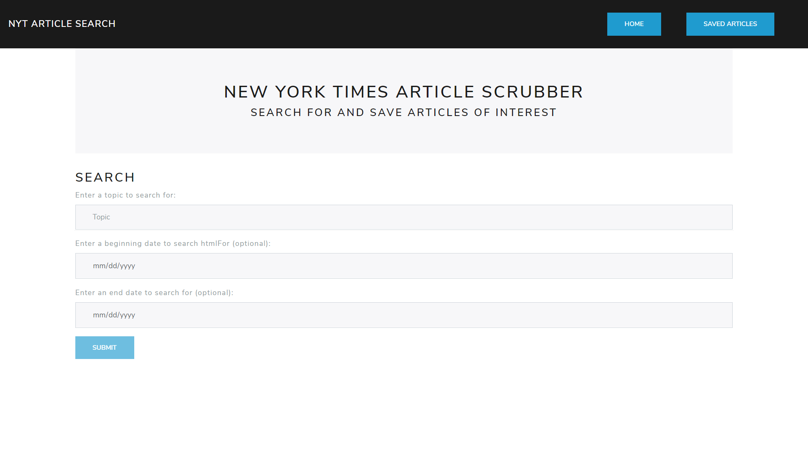
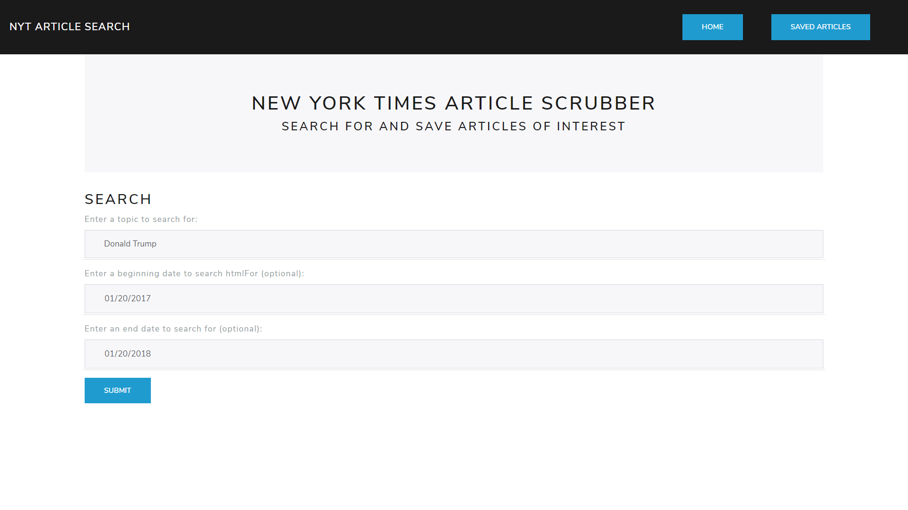
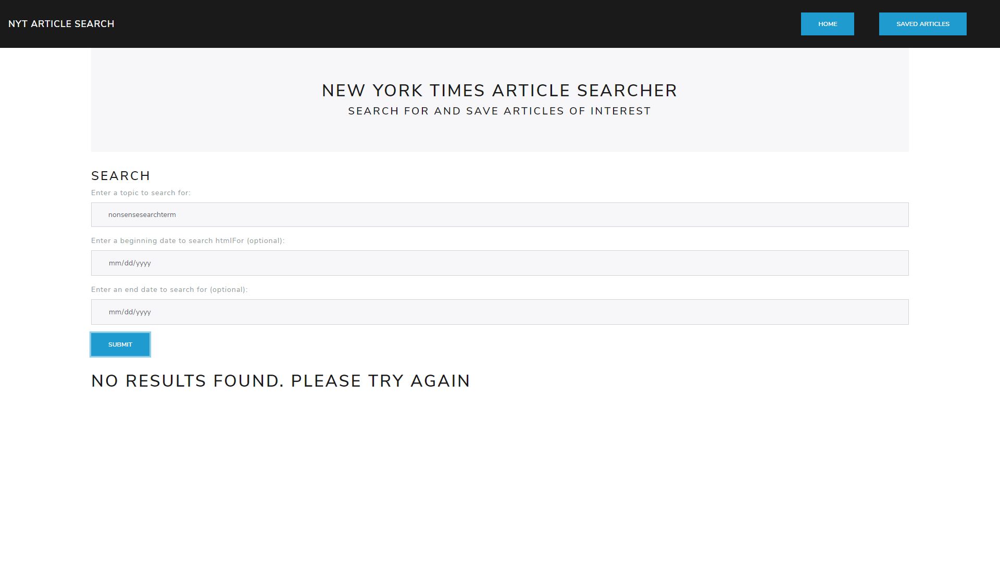
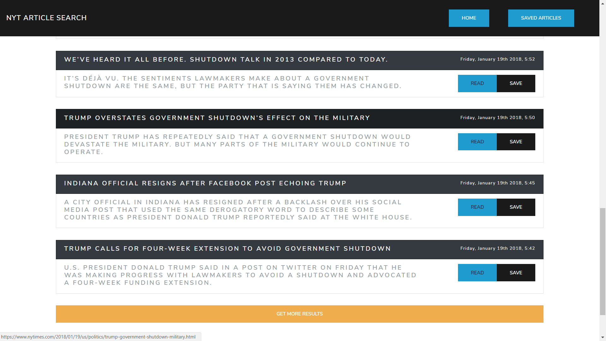
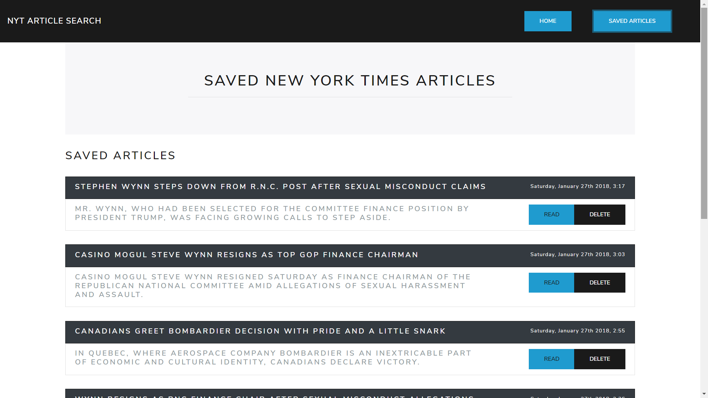
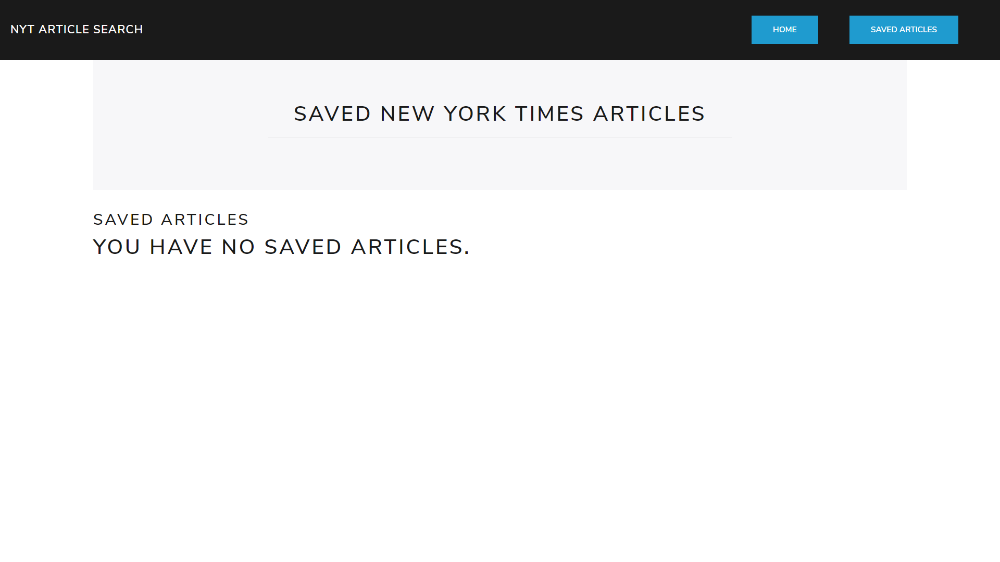

# NYT-React-Search

# React NYT Article Searcher

### [Click here](http://nyt-react-map.herokuapp.com/) to see the deployed version

### Technologies used:
* React
* Node
* express
* MongoDB
* Mongoose
* React Router
* Axios
* Yarn
* Bootstrap/Bootswatch
* HTML5
* CSS3

## This is a MERN full stack application that searches the New York Times article search API, and allows users to save articles for their future purposes.

## Users can enter search terms, with search dates going back to the begginning of the NYT in late 1851

## If no results are returned, a message is displayed to inform the user of the status of their search

## Search results are returned with headlines, dates, a summary, and links to the original NYT articles.  Results are returned in groups of 10, if a user would like to see more, they can click the 'get more results' button.  They can also save articles for later.

## This is what the user will see if they navigate to the saved articles page.  Here, they have persistent access to their saved articles, and can read or delete them at will.

